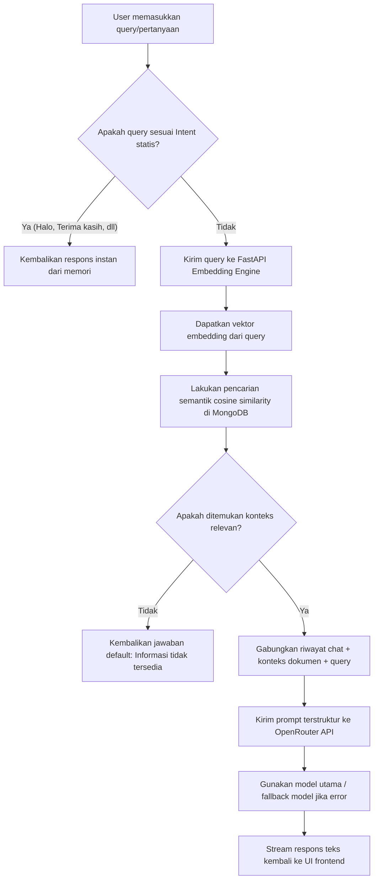

# Analisis Proyek: Website S1-TI (Teknik Informatika UKSW)

Dokumen ini menyajikan analisis mendalam mengenai arsitektur, struktur kode, teknologi, serta alur data yang diimplementasikan pada proyek **Website S1-TI**.

---

## 📌 Gambaran Umum Proyek

Proyek ini adalah sistem informasi akademik sekaligus portal utama Program Studi Teknik Informatika di Fakultas Teknologi Informasi (FTI) Universitas Kristen Satya Wacana (UKSW). Proyek ini dibangun dengan arsitektur modern berbasis microservices/containerized yang mendukung:
1. **Portal Publik**: Informasi akademik, profil dosen, pengumuman, berita, mitra kerja sama, dan tata cara admisi.
2. **CMS (Content Management System)**: Manajemen konten dan pengguna oleh Administrator dan HMP (Himpunan Mahasiswa Program Studi).
3. **Lecturer Dashboard**: Portal khusus dosen untuk mengelola profil dan publikasi mereka.
4. **RAG-based Chatbot (Mr. Wacana)**: Asisten virtual cerdas yang menjawab pertanyaan seputar kampus menggunakan data internal berbasis *Retrieval-Augmented Generation* (RAG) dan model bahasa besar (LLM).

---

## 🛠️ Stack Teknologi

Proyek ini dibagi menjadi tiga komponen utama yang berjalan di dalam kontainer Docker:

### 1. Backend (Express + TypeScript)
* **Runtime & Language**: Node.js v18+ dengan TypeScript.
* **Database**: MongoDB (Mongoose ODM) sebagai database utama.
* **Caching & Session**: Redis untuk caching response API dan session.
* **Autentikasi**: JWT (Access Token + Refresh Token) & Google OAuth 2.0 (menggunakan Passport.js).
* **Validasi**: Zod Schema.
* **Keamanan**: Helmet (HTTP headers), CORS, Express Rate Limit, dan Mongo Sanitize.
* **Image Processing**: Multer + Sharp (untuk resize dan optimasi gambar upload).
* **Logging**: Winston + Morgan (dengan rotasi log harian).
* **Load Testing**: Skenario testing menggunakan K6.

### 2. Frontend (React + Tailwind CSS)
* **Framework**: React (Create React App template) dengan React Router DOM v7 untuk routing.
* **Styling**: Tailwind CSS dengan konfigurasi dark mode dinamis.
* **State & Networking**: Axios untuk request HTTP, Context API untuk manajemen state global.
* **Interaktivitas**: Framer Motion (animasi halus), Swiper (slide karusel).
* **Input & Editor**: React MD Editor (Markdown input) dan React Image Crop.

### 3. Embedding Engine (FastAPI + ONNX)
* **Framework**: FastAPI (Python).
* **Model Embedding**: ONNX runtime dengan model `asmud/indonesian-embedding-small`.
* **Fungsi**: Memproses teks data kampus menjadi vektor embedding 384-dimensi secara lokal untuk pencarian semantik berkinerja tinggi.

---

## 📂 Struktur Direktori Proyek

```text
Website-S1-TI/
├── backend/                  # REST API (Express + TypeScript)
│   ├── src/
│   │   ├── api/v1/           # API routes, controllers, and services (Modular)
│   │   │   ├── auth/         # Autentikasi lokal & Google OAuth
│   │   │   ├── chatbot/      # Layanan RAG & integrasi OpenRouter
│   │   │   ├── users/        # Manajemen pengguna
│   │   │   └── ...           # Modul pengumuman, dosen, partner, dll.
│   │   ├── config/           # Konfigurasi Database, Redis, OAuth, Swagger
│   │   ├── model/            # Skema Mongoose (MongoDB)
│   │   ├── middleware/       # Verifikasi JWT, rate limit, upload, error handler
│   │   └── utils/            # Helper token JWT, logger, cache manager
│   ├── tests/k6/             # Load testing scripts
│   ├── Dockerfile
│   └── BACKEND_DOCUMENTATION.md
│
├── frontend/                 # Client Web App (React)
│   ├── src/
│   │   ├── components/       # Reusable components (Navbar, Footer, ChatModal)
│   │   ├── pages/            # View pages (Home, Berita, Admin CMS, Dosen)
│   │   ├── services/         # Integrasi API (axios instance)
│   │   └── App.js            # Routing utama
│   ├── Dockerfile
│   └── nginx.conf            # Konfigurasi web server production
│
├── embedding-model/          # Python Embedding Service
│   ├── embedding_engine.py   # Load model ONNX & komputasi vektor
│   ├── main.py               # REST API FastAPI (/embed & /health)
│   └── Dockerfile
│
├── nginx/                    # Reverse Proxy Nginx
└── docker-compose.yml        # Orchestration seluruh service
```

---

## 🗄️ Model Database (MongoDB + Mongoose)

Backend menggunakan Mongoose ODM dengan beberapa skema penting:
* **`UserModel`**: Menyimpan username, email, password (bcrypt), role (`admin`, `hmp`, `dosen`, `user`), googleId, status aktif, dan data login terakhir.
* **`LecturerModel`**: Profil dosen, keahlian, jam kantor, kontak, dan daftar publikasi ilmiah.
* **`AnnouncementModel`**: Berita atau pengumuman dengan kategori (`news`, `event`, `urgent`), prioritas, gambar, tag, dan tanggal kedaluwarsa.
* **`PartnersModel`**: Informasi mitra industri, logo, dan dokumen kerja sama.
* **`EmbeddingModel`**: Menyimpan teks mentah beserta representasi vektor (`embedding`) berukuran 384-dimensi untuk RAG. Memiliki index gabungan pada `contentId` dan `contentType`.
* **`KnowledgeModel`**: Data pengetahuan statis yang digunakan khusus untuk memperkaya basis data RAG.
* **`ChatMessageModel`**: Log percakapan chatbot pengguna untuk mempertahankan konteks multi-turn chat.

---

## 🧠 Alur Fitur RAG Chatbot (Mr. Wacana)

Fitur utama chatbot Mr. Wacana mengimplementasikan teknik RAG (*Retrieval-Augmented Generation*) dengan alur kerja sebagai berikut:



### Mekanisme Penting Chatbot:
1. **Fallback Model**: Jika pemanggilan model utama di OpenRouter gagal (misalnya rate limit atau error 5xx), sistem akan mencoba model alternatif secara otomatis (`Gemma 3`, `Qwen 3`, `GLM 4`).
2. **Intent Matching**: Pertanyaan umum seperti salam sapaan langsung ditangani oleh backend lokal tanpa memakan kuota token LLM.
3. **Pembatasan Konteks**: Dokumen hasil pencarian semantik dibatasi panjangnya (`compactContextLimit = 2500` karakter) guna menghemat token dan menjaga latensi tetap rendah.

---

## 🐳 Konfigurasi Container (Docker Compose)

Di lingkungan production, seluruh sistem berjalan di bawah jaringan terisolasi menggunakan Docker Compose:
1. **`website-s1ti-nginx`**: Berjalan di port 80/443. Berfungsi sebagai reverse proxy yang mengarahkan trafik frontend (`/`) dan backend (`/api/*`).
2. **`website-s1ti-frontend`**: Menjalankan build React statis menggunakan Nginx minimal.
3. **`website-s1ti-backend`**: Menjalankan aplikasi Node.js Express. Bergantung pada database MongoDB dan Redis cache.
4. **`website-s1ti-embedding-api`**: Menjalankan FastAPI python untuk inferensi model ONNX.
5. **`website-s1ti-mongodb`**: Menyimpan database persistent.
6. **`website-s1ti-redis`**: Caching data sementara dengan performa tinggi.

---

## 🔑 Poin Penting & Rekomendasi Pengembangan

1. **Penggunaan Redis**: Caching diimplementasikan pada API pengumuman dan daftar dosen untuk menghindari query berulang ke MongoDB, meningkatkan waktu respons client secara signifikan.
2. **Keamanan Data**: Google OAuth terintegrasi dengan mulus. Untuk rute administratif, terdapat middleware `ProtectedRoute` di frontend dan validasi otorisasi berbasis role di backend.
3. **Optimasi Asset**: Penggunaan Sharp di backend sangat baik untuk mengurangi beban penyimpanan dengan otomatis meresize foto profil dosen dan gambar berita ke format WebP terkompresi sebelum disimpan.
